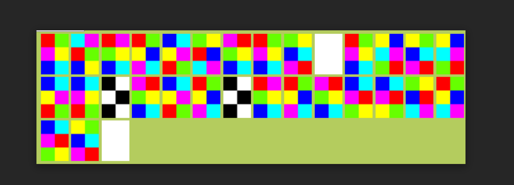

Challenge
```
Can you get me my message? Note: add {} accordingly in the decoded text and replace . with _ 
https://drive.google.com/file/d/16s56Brm--raQKuFrMTP7wgkKm6kjFiX9/view?usp=sharing
```

Going to the link gave me a image 



After googling a bit about color ciphers I found this


which is stated as hexahue alphabet and after decoding it I got the flag

flag: ``` cyberhack{colors_are_beautiful}```
