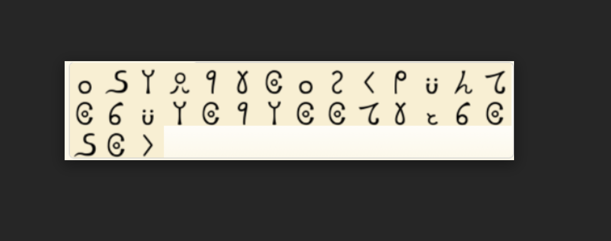

Challenge 
```
Do you have any idea about the legend of Zelda? https://drive.google.com/file/d/1o538CQYdjpMs4I31L1-fxjWulY_4YHI2/view?usp=sharing
```

Going to the link gave me a png file 



So i googled as the Challenge says legend of Zelda and after 2 to 3 google searches i found the cipher is coded in ```Goron Language``` and the 
challenge name was the biggest hint and going to its decoder ```https://www.dcode.fr/goron-cipher``` and decoding it gave me the flag

flag: ```cyberhack(ZiNdaGibarbaadhoGaya)```
