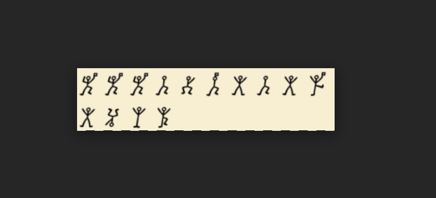

Challenge
```
Challenge File Link- https://drive.google.com/file/d/1YPSgVtU9KqEytRKP3G6cl-r5pX4xUzni/view?usp=sharing 
Final finding will be enclosed in cyberhack{} for getting flag.
```

Going to the link gave me a image 



After googling for some time and some reverse image search I found out it was ```Dancing Men Cipher``` and found a online decoder 
```https://www.dcode.fr/dancing-men-cipher```

So decoding it gave me ```FFFbyBebeRexha``` so enclosing this in cyberhack{} will be the flag

flag: ```cyberhack{FFFbyBebeRexha}```
