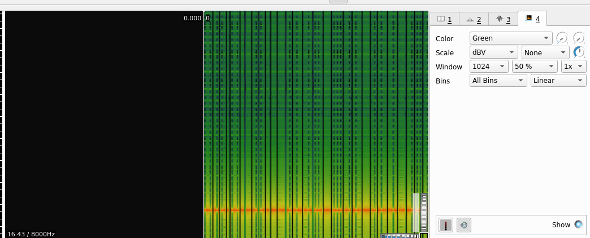

Challenge:
```
dit dah huh ???????? NOTE: Wrap the flag in cyberhack{} https://drive.google.com/file/d/1fxzpYCgFZom64kZjV1hLGsILA15ZoufQ/view?usp=sharing
```
This gave me a ```.wav``` file. I used ```Sonic Visualizer``` for spectogram and found this



It doesn't have any message hidden but look at the challenge line ```dit dah huh``` which is the hint that it is dot and dashes which is morse code. I have played CTFs 
which have morse code on a wav file so I googled for online decoders and found ```https://morsecode.world/international/decoder/audio-decoder-adaptive.html```

After decoding you will get ```KANEKISANISHALFGHOULHALFHUMAN```

flag:```cyberhack{KANEKISANISHALFGHOULHALFHUMAN}```
